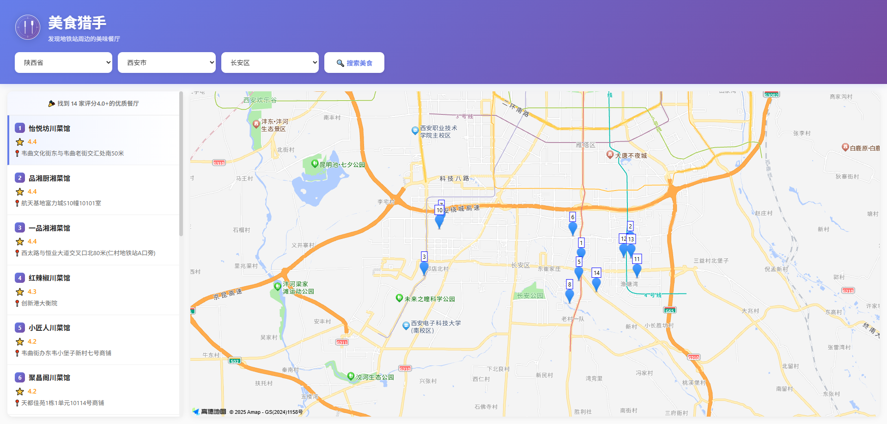

#  美食猎手(FoodHunter)

一个基于高德地图 API 的纯前端美食发现工具，帮助你找到地铁站周边的优质餐厅。

访问地址：https://xdxsb.top/FoodHunter

## ✨ 特性

- 🔍 **地铁站搜索** - 自动搜索选定城市/区县的所有地铁站
- 🍽️ **品质过滤** - 只显示评分 ≥ 4.0 的优质餐厅
- ⭐ **智能排序** - 搜索结果按评分从高到低排序
- 🗺️ **交互式地图** - 点击餐厅在地图上查看具体位置
- 📱 **响应式设计** - 完美适配手机、平板和桌面端
- 🎨 **现代化UI** - 简洁优雅的界面，流畅的动画效果
- 🚀 **纯前端实现** - 无需后端，可直接部署到 GitHub Pages

## 📸 界面截图

### 


## 🚀 快速开始

### 前置要求

- 现代浏览器（Chrome、Firefox、Safari、Edge）
- 网络连接（用于访问高德地图 API）

### 安装步骤

1. 克隆仓库：

```bash
git clone https://github.com/yourusername/food_agent.git
cd food_agent
```

2. 在浏览器中打开 `index.html`：

```bash
# Windows
start index.html

# macOS
open index.html

# Linux
xdg-open index.html
```

就这么简单！无需构建过程或安装依赖。

## 🌐 部署到 GitHub Pages

1. 将代码推送到 GitHub
2. 进入仓库的 Settings > Pages
3. 选择 Source: `main` 分支
4. 你的网站将在以下地址可用：`https://你的用户名.github.io/food_agent/`

## 🛠️ 技术栈

- **纯 HTML/CSS/JavaScript** - 无需框架
- **高德地图 Web API** - 位置和 POI 搜索
- **高德地图 JavaScript API** - 交互式地图展示
- **响应式设计** - CSS 媒体查询适配所有设备

## 📱 移动端支持

- ✅ iOS Safari
- ✅ Android Chrome
- ✅ 微信内置浏览器
- ✅ 触摸滚动优化
- ✅ 横竖屏自适应
- ✅ 动态视口高度

## 🎨 功能详解

### 省市区三级联动

- 三级级联选择器
- 通过 API 动态加载区县数据
- 使用 adcode 精确到区县级搜索

### 餐馆搜索

- 搜索选定区域内的所有地铁站
- 以每个地铁站为中心进行周边搜索（半径1000米）
- 自动去重
- 仅显示评分 ≥ 4.0 的餐厅

### 地图集成

- 为每个餐厅添加带序号的标记
- 点击标记或列表项查看详情
- 自动调整地图视野显示所有结果
- 信息窗口显示评分和地址

## 🤝 贡献

欢迎贡献！请随时提交 Pull Request。

1. Fork 本项目
2. 创建特性分支 (`git checkout -b feature/AmazingFeature`)
3. 提交更改 (`git commit -m 'Add some AmazingFeature'`)
4. 推送到分支 (`git push origin feature/AmazingFeature`)
5. 开启 Pull Request

## 📝 开源协议

本项目采用 MIT 协议 - 详见 [LICENSE](LICENSE) 文件。

## ⚠️ 免责声明

- 本项目使用高德地图 API 服务，请遵守[高德地图服务条款](https://lbs.amap.com/home/terms/)
- 餐厅评分和信息由高德地图提供，可能不完全准确
